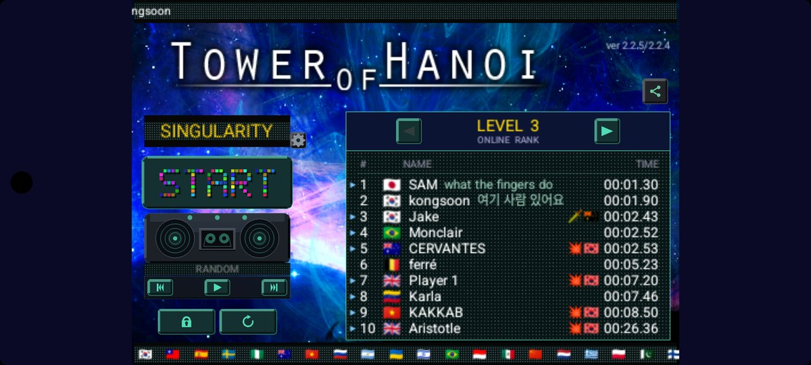
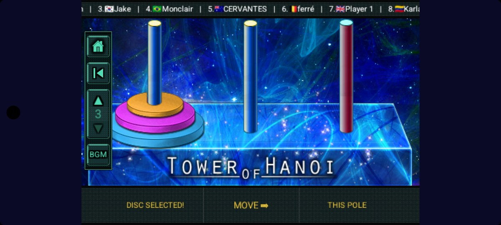
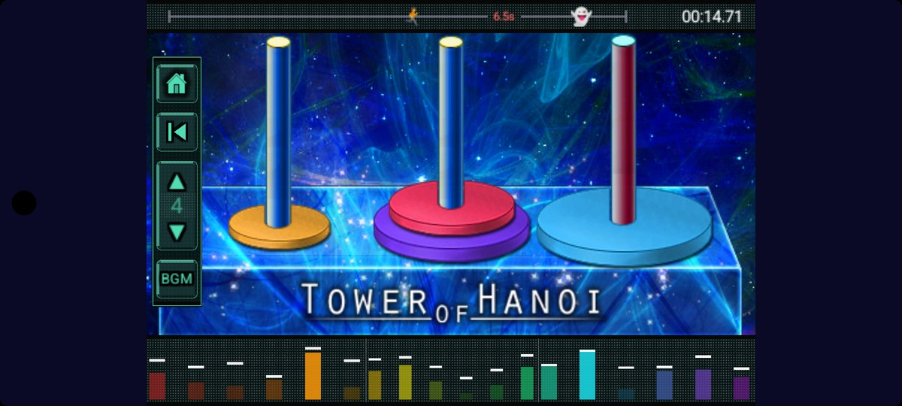

# Tower of Hanoi - Speedrun

**The classic Tower of Hanoi, reimagined as a global speedrun.**
Race the clock, climb the world rankings, and challenge the ghosts of the top players.

🌐 **Website — [ozzywow.github.io/Hanoi](https://ozzywow.github.io/Hanoi/)** · 📺 [Gameplay video](https://www.youtube.com/playlist?list=PLroZX8uYzY2elRlhZX0w9sxccG0kpv583)

## Features

| | |
|---|---|
| 🏆 **Global Rankings** | Compete level by level against players worldwide. Every millisecond counts. |
| 👻 **Ghost Race & Revenge** | Race the recorded runs of top rankers — and take your revenge when someone beats you. |
| ⏱️ **Speedrun Timing** | Millisecond-precise timing with a live RPM meter that rewards fast, clean solving. |
| 📼 **Replays** | Watch your best runs back, or spectate the rankers to learn their fastest routes. |
| 🌍 **Fly Your Flag** | Represent your country on the boards and see where you stand on the world stage. |
| 🎵 **Chiptune BGM** | A built-in 8-bit music player sets the pace while you climb the tower. |

## Built with

- **Engine** — [Cocos2d-x](https://www.cocos.com/en/cocos2dx) (C++)
- **Backend** — PlayFab (leaderboards, replay storage, CloudScript)
- **Platforms** — iOS · Android · Windows · macOS
- **Rendering** — logical 960×640, all HUD/UI drawn procedurally (vector icons, 5×7 pixel font, LED panels)

## Repository layout

| Path | |
|---|---|
| `Classes/` | Cross-platform game code (scenes, draw utilities, IAP facade) |
| `proj.android/` | Android build (CMake + Gradle) |
| `proj.ios_mac/` | iOS / macOS build |
| `landing/` | Source of the marketing & support site (deployed from the `gh-pages` branch) |
| `docs/` | Architecture notes and feature design documents |

## Support

Questions, bug reports, or feedback — [ozzywow2@gmail.com](mailto:ozzywow2@gmail.com)

- [Help & FAQ](https://ozzywow.github.io/Hanoi/#support)
- [Privacy Policy](https://ozzywow.github.io/Hanoi/privacy.html)
